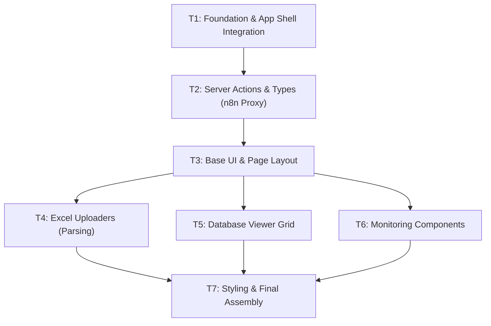

# Cobranza (Vandelier AI) Integration — Micro-Agent Task Breakdown

> Each task is designed for a **fresh context window**. The agent reads ONLY the files listed in "Context Files" plus this task description. No prior conversation needed.

---

## Dependency Graph

---

## T1: Foundation & App Shell Integration

**Status**: `[ ]`

### Context Brief
Vocero CRM uses optional modules behind environment flags (e.g., `AGENDA=on`). We are integrating the Vandelier AI dashboard under a new `COBRANZA=on` flag. This task sets up the feature flag and injects the "Cobranza" module into the application's sidebar navigation and App Shell layout.

### Context Files (read these first)
- `src/lib/env.ts` — existing env schema with Zod.
- `src/server/agenda/flag.ts` — example flag helper (copy this pattern).
- `src/components/app-nav.tsx` — sidebar navigation.
- `src/components/app-shell.tsx` — shell props.
- `src/app/(app)/layout.tsx` — where flags are passed to the shell.

### Deliverables
1. **`src/server/cobranza/flag.ts`** [NEW]: Export `cobranzaEnabled()` checking `process.env.COBRANZA === "on"`.
2. **`src/lib/env.ts` & `.env.example`** [MODIFY]: Add `COBRANZA` to the Zod schema and example file.
3. **App Shell Routing** [MODIFY]: 
   - Add `cobranza={cobranzaEnabled()}` to `<AppShell>` in `src/app/(app)/layout.tsx`.
   - Update `app-nav.tsx` to include the route: `{ label: "Cobranza", href: "/cobranza", icon: Banknote, show: cobranza }`.
4. **`src/app/(app)/cobranza/page.tsx`** [NEW]: Create an empty placeholder page that checks auth and redirects if `!cobranzaEnabled()`.

### Acceptance Criteria
- `pnpm typecheck` passes.
- "Cobranza" navigation item only appears when the environment variable is set.

### Dependencies
- None.

---

## T2: Server Actions & Types (n8n Proxy)

**Status**: `[ ]`

### Context Brief
The original Vandelier dashboard queried `n8n.vandelierai.com` directly from the client. To ensure security and avoid CORS issues, we will proxy these requests through Next.js Server Actions. The n8n backend relies on a unified `BackendRow` data model.

### Context Files
- `C:\Users\Kento\AICode\VRDemons\vandelierai.com\doc\PRD.md` — reference for the API endpoints and `BackendRow` model.
- `C:\Users\Kento\AICode\VRDemons\vandelierai.com\src\services\n8n.ts` — reference for webhook payloads.

### Deliverables
1. **`src/types/cobranza.ts`** [NEW]:
   - Define `BackendRow` interface (Folio, Cliente, Telefono, FechaExigibilidad, Producto, Total, Mora, Pagado).
2. **`src/server/cobranza/actions.ts`** [NEW] (`"use server"`):
   - `getWorkflowStatus()`: POST to `/webhook/n8n-workflow` with `{ operation: "status" }`.
   - `toggleWorkflow(active: boolean)`: POST to activate/deactivate.
   - `fetchDataTable()`: POST to `/webhook/datatable` with `{ operation: "select" }`.
   - `upsertData(data: BackendRow[])`: POST to `/webhook/datatable` with `{ operation: "upsert", data }`.
   - `updateRow(data: BackendRow)`: POST to `/webhook/datatable` with `{ operation: "update", data: [data] }`.
   - All actions must verify session authorization and `cobranzaEnabled()` before fetching.

### Acceptance Criteria
- Strongly typed Server Actions exported.
- Actions correctly encapsulate the n8n endpoint URLs (hardcoded or from env vars).
- Auth/flag verification present in all actions.

### Dependencies
- T1 (Feature Flag).

---

## T3: Base UI & Page Layout

**Status**: `[ ]`

### Context Brief
The dashboard uses an "Accordion" pattern to organize complex modules (Upload, Data Grid, KPIs). We need to set up this base layout and port the system toggle header.

### Context Files
- `C:\Users\Kento\AICode\VRDemons\vandelierai.com\src\components\Header.tsx`
- `C:\Users\Kento\AICode\VRDemons\vandelierai.com\src\App.tsx` (for layout reference)
- `src/components/ui/` (use Vocero's existing UI primitives like switches/modals where possible)

### Deliverables
1. **`src/components/cobranza/accordion.tsx`** [NEW]: Client component that takes a `title`, `badgeNumber`, and `children`. Handles collapsible state.
2. **`src/components/cobranza/header.tsx`** [NEW]: Client component containing the "Activar Sistema de Cobranza" toggle. 
   - Uses the `getWorkflowStatus` and `toggleWorkflow` Server Actions from T2.
   - Includes a confirmation modal before toggling state.
3. **`src/app/(app)/cobranza/page.tsx`** [MODIFY]: 
   - Integrate the new Header.
   - Set up the main state wrapper (e.g., `refreshTrigger` to sync the table when an upload finishes).

### Acceptance Criteria
- Header successfully reads and toggles n8n workflow state via Server Actions.
- Accordion component successfully expands/collapses content.

### Dependencies
- T2 (Server Actions).

---

## T4: Excel Uploaders (Parsing)

**Status**: `[ ]`

### Context Brief
Port the drag-and-drop Excel uploading and parsing logic from the original project. The original used SheetJS (`xlsx`) to extract data heuristically client-side before sending it to the backend. We must retain this exact heuristic logic.

### Context Files
- `package.json`
- `C:\Users\Kento\AICode\VRDemons\vandelierai.com\src\components\DuePaymentsUploader.tsx`
- `C:\Users\Kento\AICode\VRDemons\vandelierai.com\src\components\LatePaymentsUploader.tsx`

### Deliverables
1. **`package.json`** [MODIFY]: Add `"xlsx": "^0.18.5"` or `"https://cdn.sheetjs.com/xlsx-0.20.3/xlsx-0.20.3.tgz"`.
2. **`src/components/cobranza/upload/due-payments-uploader.tsx`** [NEW]:
   - Client component containing drag & drop zone.
   - Exact port of the product detection (ARRENDAMIENTOS vs PRESTAMOS scanning first 20 rows).
   - Exact port of the column mapping heuristics.
   - Displays parsed data preview.
   - Submits via `upsertData()` Server Action (T2) and triggers page refresh.
3. **`src/components/cobranza/upload/late-payments-uploader.tsx`** [NEW]:
   - Port the late payments variant following the same logic.

### Acceptance Criteria
- Heuristics map columns and detect products exactly as they did in the original app.
- Upload calls Server Action instead of raw webhook.
- Visual feedback (loading, success, error) matches original UX.

### Dependencies
- T2 (Server Actions), T3 (Base Layout).

---

## T5: Database Viewer Grid

**Status**: `[ ]`

### Context Brief
Port the interactive data grid. The component fetches `BackendRow` data from n8n and provides client-side pagination, searching, sorting, and inline row editing.

### Context Files
- `C:\Users\Kento\AICode\VRDemons\vandelierai.com\src\components\DatabaseViewer.tsx`
- `src/server/cobranza/actions.ts` (from T2)

### Deliverables
1. **`src/components/cobranza/database-viewer.tsx`** [NEW]:
   - Client component fetching data on mount (via `fetchDataTable()`).
   - Re-fetches when `refreshTrigger` prop changes.
   - Client-side pagination and sorting state.
   - Global text search filtering across columns.
   - Inline edit mode for rows. On save, calls `updateRow()` Server Action.
   - Responsive design (horizontal scroll on mobile).

### Acceptance Criteria
- Grid accurately reflects data from n8n.
- Pagination, search, and sort work flawlessly.
- Inline edits successfully trigger the Server Action and update the UI.

### Dependencies
- T2 (Server Actions), T3 (Base Layout).

---

## T6: Monitoring Components

**Status**: `[ ]`

### Context Brief
Port the static, read-only monitoring components: KPI Dashboard, FlowChart, and Special Cases.

### Context Files
- `C:\Users\Kento\AICode\VRDemons\vandelierai.com\src\components\KpiDashboard.tsx`
- `C:\Users\Kento\AICode\VRDemons\vandelierai.com\src\components\FlowChart.tsx`
- `C:\Users\Kento\AICode\VRDemons\vandelierai.com\src\components\SpecialCases.tsx`

### Deliverables
1. **`src/components/cobranza/monitoring/kpi-dashboard.tsx`** [NEW]: Direct UI port.
2. **`src/components/cobranza/monitoring/flow-chart.tsx`** [NEW]: Direct UI port (preserves SVG or visual logic).
3. **`src/components/cobranza/monitoring/special-cases.tsx`** [NEW]: Direct UI port.

### Acceptance Criteria
- Components render correctly without breaking the page.
- Vandelier branding colors (Slate/Blue/Cyan) are maintained locally inside these components.

### Dependencies
- T3 (Base Layout).

---

## T7: Styling & Final Assembly

**Status**: `[ ]`

### Context Brief
Integrate the custom Tailwind animations used by Vandelier and assemble all ported components into the final page layout using Accordions.

### Context Files
- `tailwind.config.ts`
- `src/app/(app)/cobranza/page.tsx`
- All components created in T3-T6.

### Deliverables
1. **`tailwind.config.ts`** [MODIFY]:
   - Add Vandelier animations to `theme.extend`: `blob`, `fade-in`, `fade-in-up`, `slide-in-from-top-2`, etc.
2. **`src/app/(app)/cobranza/page.tsx`** [MODIFY]:
   - Assemble the dashboard:
     - Render Header (T3).
     - Render `ReportsDashboard` equivalent (wrapping Due Uploader and Late Uploader in an Accordion).
     - Render `DatabaseViewer` (T5) in an Accordion.
     - Render Monitoring Components (T6) in an Accordion.
   - Wire the `refreshTrigger` state from Uploaders to the DatabaseViewer.

### Acceptance Criteria
- Custom animations function as expected.
- Page acts as a unified SPA (React state properly synchronizes updates between Uploaders and Viewer).
- Follows Next.js best practices (Client vs Server components handled correctly).
- `pnpm typecheck` and `pnpm build` pass with zero regressions.

### Dependencies
- All previous tasks.
