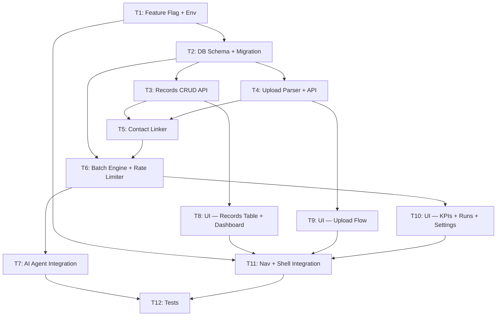

# Cobranza Integration — Micro-Agent Task Breakdown

> Each task is designed for a **fresh context window**. The agent reads ONLY the files listed in "Context Files" plus this task description. No prior conversation needed.

---

## Dependency Graph



---

## T1: Feature Flag + Environment Variables

**Status**: `[ ]`

### Context Brief
Vocero CRM uses optional modules behind environment flags (e.g., `AGENDA=on`, `ATRIBUCION=on`). Each flag has a helper in `src/server/{module}/flag.ts` and its variables registered in `src/lib/env.ts`. We're adding a new module `COBRANZA=on` that follows the same pattern.

### Context Files (read these first)
- `src/lib/env.ts` — existing env schema with Zod, see how AGENDA/ATRIBUCION are defined
- `src/server/agenda/flag.ts` — example flag helper (copy this pattern exactly)
- `.env.example` — see existing documentation format for env vars

### Deliverables
1. **`src/server/cobranza/flag.ts`** [NEW]
   ```typescript
   export function cobranzaEnabled(): boolean {
     return process.env.COBRANZA === "on";
   }
   ```

2. **`src/lib/env.ts`** [MODIFY] — add to the `envSchema` object:
   ```typescript
   COBRANZA: z.string().optional(),
   COBRANZA_API_KEY: z.string().optional(),
   COBRANZA_SMTP_HOST: z.string().optional(),
   COBRANZA_SMTP_PORT: z.coerce.number().default(465),
   COBRANZA_SMTP_USER: z.string().optional(),
   COBRANZA_SMTP_PASS: z.string().optional(),
   COBRANZA_SMTP_FROM: z.string().optional(),
   ```

3. **`.env.example`** [MODIFY] — append at end with inline docs:
   ```bash
   # ── Cobranza (optional, off by default) ────────────────────────
   # COBRANZA=on                        # Enable collection management module
   # COBRANZA_API_KEY=                   # API key for n8n to trigger batch runs (POST /api/cobranza/batch)
   # COBRANZA_SMTP_HOST=smtp.gmail.com   # SMTP for email collection sub-flow
   # COBRANZA_SMTP_PORT=465
   # COBRANZA_SMTP_USER=
   # COBRANZA_SMTP_PASS=
   # COBRANZA_SMTP_FROM=
   ```

### Acceptance Criteria
- `pnpm typecheck` passes
- Importing `cobranzaEnabled()` works from any server file
- No existing tests break

### Dependencies
None — this is the foundation.

---

## T2: Database Schema + Migration

**Status**: `[ ]`

### Context Brief
Vocero uses Drizzle ORM with PostgreSQL. All domain tables have `organization_id` NOT NULL for multi-tenancy. IDs use nanoid with prefixes (see `src/lib/db/ids.ts`). We need 5 new tables for the collection module. After editing schema.ts, run `pnpm db:generate` to create the migration SQL.

### Context Files
- `src/lib/db/schema.ts` — existing schema (study patterns: pgTable, indexes, references, timestamp defaults)
- `src/lib/db/ids.ts` — ID generation with prefixes (add new prefixes: `cr_`, `cu_`, `crun_`, `csl_`)
- `src/lib/db/tenant.ts` — `scoped()` helper for multi-tenant queries
- `drizzle.config.ts` — drizzle-kit configuration
- `src/lib/money.ts` — money handling (amounts in cents)

### Deliverables
1. **`src/lib/db/ids.ts`** [MODIFY] — add prefixes:
   ```typescript
   cr: "cr",       // collection_record
   cu: "cu",       // collection_upload
   crun: "crun",   // collection_run
   csl: "csl",     // collection_send_log
   ```

2. **`src/lib/db/schema.ts`** [MODIFY] — add 5 tables at the end (before any existing exports if needed):

   **`collectionRecord`** — core debtor table:
   - `id` text PK (cr_xxxxx)
   - `organizationId` text FK → organization.id, NOT NULL
   - `contactId` text FK → contact.id, nullable (linked after upload)
   - `folio` text NOT NULL
   - `clientName` text NOT NULL
   - `phone` text nullable
   - `email` text nullable
   - `contactName` text nullable
   - `rfc` text nullable
   - `personalidad` text nullable (MORAL/FISICA)
   - `product` text NOT NULL (ARRENDAMIENTOS/PRESTAMOS)
   - `dueDate` timestamp nullable
   - `totalAmount` integer nullable (cents)
   - `lateAmount` integer nullable (cents, mora)
   - `paid` boolean default false
   - `status` text default "active" (active/ya_pague/wrong_number/no_response/resolved)
   - `lastContactedAt` timestamp nullable
   - `createdAt` timestamp defaultNow
   - `updatedAt` timestamp defaultNow
   - Index on `organizationId`
   - Unique index on `(organizationId, folio)`

   **`collectionUpload`** — upload history:
   - `id` text PK (cu_xxxxx)
   - `organizationId` text FK NOT NULL
   - `fileName` text NOT NULL
   - `uploadType` text NOT NULL (due/late)
   - `productType` text nullable
   - `recordCount` integer NOT NULL
   - `uploadedBy` text FK → user.id NOT NULL
   - `createdAt` timestamp defaultNow

   **`collectionRun`** — batch execution log:
   - `id` text PK (crun_xxxxx)
   - `organizationId` text FK NOT NULL
   - `runType` text NOT NULL (preventivo/payday/atrasado/email)
   - `triggeredBy` text NOT NULL (n8n/manual/user_id)
   - `totalEligible` integer default 0
   - `totalSent` integer default 0
   - `totalFailed` integer default 0
   - `startedAt` timestamp defaultNow
   - `finishedAt` timestamp nullable
   - `status` text default "running" (running/completed/failed)

   **`collectionSendLog`** — per-message tracking:
   - `id` text PK (csl_xxxxx)
   - `runId` text FK → collectionRun.id NOT NULL
   - `recordId` text FK → collectionRecord.id NOT NULL
   - `channel` text NOT NULL (whatsapp/email)
   - `templateName` text nullable
   - `waMessageId` text nullable
   - `status` text default "queued" (queued/sent/delivered/read/failed)
   - `error` text nullable
   - `sentAt` timestamp defaultNow

   **`collectionWorkflowConfig`** — per-org config:
   - `organizationId` text PK FK → organization.id
   - `active` boolean default false
   - `flowPreventivo` boolean default true
   - `flowPayday` boolean default true
   - `flowAtrasado` boolean default true
   - `flowEmail` boolean default false
   - `templatePreventivo` text nullable
   - `templatePayday` text nullable
   - `templateAtrasado` text nullable
   - `updatedAt` timestamp defaultNow

3. **Run**: `pnpm db:generate` — creates migration in `drizzle/`

### Acceptance Criteria
- `pnpm typecheck` passes
- `pnpm db:generate` succeeds and creates a new `.sql` migration file
- All tables follow existing schema patterns (timestamps, FK references, indexes)
- ID prefixes are unique and don't conflict with existing ones

### Dependencies
- T1 (feature flag must exist, though schema doesn't import it)

---

## T3: Records CRUD API

**Status**: `[ ]`

### Context Brief
Create API routes for collection record CRUD. Vocero uses Next.js App Router API routes (`src/app/api/`). Every route must: check auth via `getSessionOrNull()`, scope queries with `scoped()` for multi-tenancy, validate input with Zod, and return 404 when `COBRANZA` is off.

### Context Files
- `src/app/api/contacts/route.ts` — example API route pattern (auth, scoped, Zod validation)
- `src/app/api/pipeline/route.ts` — another example with pagination
- `src/lib/db/tenant.ts` — `scoped()` helper
- `src/lib/api.ts` — API helper utilities
- `src/lib/db/schema.ts` — the `collectionRecord` table definition (from T2)
- `src/server/cobranza/flag.ts` — feature flag (from T1)

### Deliverables
1. **`src/server/cobranza/records.ts`** [NEW] — query helpers:
   - `listRecords(orgId, { search, sort, page, pageSize, status, dateFilter })` → paginated results
   - `getRecord(orgId, recordId)` → single record
   - `updateRecord(orgId, recordId, data)` → inline edit
   - `deleteAllRecords(orgId)` → clear database with safety check
   - All use `scoped()` for tenant isolation

2. **`src/app/api/cobranza/records/route.ts`** [NEW]:
   - `GET` — paginated list with query params: `?search=&sort=folio&dir=asc&page=1&pageSize=10&status=active&date=`
   - `PATCH` — update single record `{ id, ...fields }`
   - `DELETE` — clear all (requires `{ confirm: "DELETE_ALL" }` body)
   - All check `cobranzaEnabled()` first → 404 if off
   - All check auth → 401 if no session

### Acceptance Criteria
- `pnpm typecheck` passes
- GET returns paginated JSON with `{ data: [], total, page, pageSize }`
- PATCH validates input with Zod
- DELETE requires confirmation token
- All routes return 404 when `COBRANZA` env is not set
- All routes return 401 without auth

### Dependencies
- T1 (flag), T2 (schema)

---

## T4: Upload Parser + API

**Status**: `[ ]`

### Context Brief
Port the Excel parsing logic from vandelierai.com's `DuePaymentsUploader.tsx` and `LatePaymentsUploader.tsx` to server-side code. The original used SheetJS (xlsx) client-side. We'll parse server-side for security. The format is Vandelier-specific: auto-detect ARRENDAMIENTOS vs PRESTAMOS from first 20 rows, find header row dynamically, map to our schema.

Add `xlsx` dependency to package.json.

### Context Files
- `D:\AICode\VRDemons\vandelierai.com\src\components\DuePaymentsUploader.tsx` — original Excel parser (study `processFile`, header detection, field mapping)
- `D:\AICode\VRDemons\vandelierai.com\src\components\LatePaymentsUploader.tsx` — late payments parser (different header format)
- `D:\AICode\VRDemons\vandelierai.com\doc\PRUEBAS ARRENDAMIENTOS.xls` — test file
- `src/lib/db/schema.ts` — `collectionRecord` and `collectionUpload` tables
- `package.json` — add xlsx dependency here

### Deliverables
1. **`package.json`** [MODIFY] — add dependency:
   ```json
   "xlsx": "https://cdn.sheetjs.com/xlsx-0.20.3/xlsx-0.20.3.tgz"
   ```
   Run `pnpm install` after.

2. **`src/server/cobranza/upload-parser.ts`** [NEW]:
   - `parseExcel(buffer: Buffer): ParseResult` — parses XLSX/CSV buffer
   - Auto-detects product type (scan first 20 rows for "ARRENDAMIENTOS")
   - Finds header row dynamically (looks for known column names)
   - Maps columns to `collectionRecord` fields
   - Normalizes phone numbers (521→52 pattern from `src/server/inbox/identity.ts`)
   - Normalizes personalidad (MORAL/FISICA)
   - Returns `{ productType, records: ParsedRecord[], errors: string[] }`

3. **`src/app/api/cobranza/upload/route.ts`** [NEW]:
   - `POST` — accepts `multipart/form-data` with `.xlsx`/`.csv` file
   - Parses server-side, returns preview: `{ productType, records: [...], recordCount, errors }`
   - Does NOT commit to DB yet (preview step)

4. **`src/app/api/cobranza/upload/confirm/route.ts`** [NEW]:
   - `POST` — accepts `{ records: ParsedRecord[], uploadType: "due"|"late" }`
   - Upserts into `collectionRecord` by `(organizationId, folio)`
   - Creates `collectionUpload` log entry
   - Returns `{ inserted, updated, total }`

### Acceptance Criteria
- `pnpm install` succeeds with xlsx
- `pnpm typecheck` passes
- Parser correctly detects ARRENDAMIENTOS vs PRESTAMOS
- Parser handles both DuePayments and LatePayments Excel formats
- Phone normalization works (521→52)
- Upload preview returns structured data without committing
- Confirm endpoint upserts (insert new, update existing by folio)

### Dependencies
- T1 (flag), T2 (schema)

---

## T5: Contact Linker

**Status**: `[ ]`

### Context Brief
After Excel records are upserted, link each debtor to a Vocero contact. Vocero contacts are identified by `wa_identity` (normalized phone or `bsuid:xxx`). If a debtor's phone matches an existing contact, link them. If not, create a new contact. This allows the AI agent to see debt context when a debtor writes on WhatsApp.

### Context Files
- `src/server/contacts.ts` — existing contact CRUD
- `src/server/inbox/identity.ts` — phone normalization and `wa_identity` logic
- `src/server/contact-source.ts` — how contacts are created from different sources
- `src/lib/db/schema.ts` — `contact` table structure AND `collectionRecord.contactId` FK
- `src/lib/ficha.ts` — key-value custom data per contact ("ficha")
- `src/server/leads.ts` — pipeline stage management

### Deliverables
1. **`src/server/cobranza/contact-linker.ts`** [NEW]:
   - `linkRecordsToContacts(orgId: string, recordIds: string[]): Promise<LinkResult>`
   - For each record with a phone:
     1. Normalize phone using existing identity logic
     2. Search contacts by `wa_identity`
     3. If found → set `collectionRecord.contactId = contact.id`
     4. If NOT found → create contact with `clientName` as name, set phone, set pipeline stage "Nuevo"
     5. Store folio + product in contact's ficha (`ficha.cobranza_folio`, `ficha.cobranza_product`)
   - Returns `{ linked: number, created: number, skipped: number }`
   - Must be idempotent (re-linking same record doesn't duplicate contacts)

2. **Modify `src/app/api/cobranza/upload/confirm/route.ts`** (from T4):
   - After upsert, call `linkRecordsToContacts()` for all upserted record IDs
   - Return link stats in response

### Acceptance Criteria
- Linking by phone matches existing contacts correctly
- New contacts are created with proper pipeline stage
- Ficha data is stored for agent context
- Re-running link on same records is idempotent
- Records without phone numbers are skipped (not errored)
- `pnpm typecheck` passes

### Dependencies
- T2 (schema), T3 (records), T4 (upload)

---

## T6: Batch Engine + Rate Limiter

**Status**: `[ ]`

### Context Brief
Build the collection engine that processes batch runs. n8n calls `POST /api/cobranza/batch` with an API key to trigger a run. The engine queries eligible records, selects the right WhatsApp template, sends messages via Vocero's existing WhatsApp send infrastructure, respects Meta's rate limits, and logs everything.

Vocero sends WhatsApp messages via Meta's Graph API through `src/server/whatsapp/send.ts` (or similar). The collection engine reuses this — it does NOT create a new WhatsApp integration.

### Context Files
- `src/server/whatsapp/` — existing WhatsApp send infrastructure
- `src/server/inbox/send.ts` or similar — how messages are sent today
- `src/lib/meta/` — Meta Graph API client
- `src/lib/templates.ts` — template handling
- `src/lib/db/schema.ts` — `collectionRun`, `collectionSendLog`, `collectionRecord`, `collectionWorkflowConfig`
- `src/lib/rate-limit.ts` — existing rate limiter (study the pattern)
- `src/server/cobranza/flag.ts` — feature flag

### Deliverables
1. **`src/server/cobranza/engine.ts`** [NEW]:
   - `runBatch(orgId, runType, triggeredBy): Promise<RunResult>`
   - Steps:
     1. Check `collectionWorkflowConfig.active` and the specific flow toggle
     2. Query eligible records: status=active, paid=false, not contacted today (`lastContactedAt` check), due date matches run type logic:
        - `preventivo`: due_date is 3-5 days from now
        - `payday`: due_date is today
        - `atrasado`: due_date is past and late_amount > 0
        - `email`: same as atrasado but sends email instead of WhatsApp
     3. Create `collectionRun` record with status=running
     4. For each eligible record, create `collectionSendLog` with status=queued
     5. Process queue with rate limiter (see below)
     6. Update `collectionRun` with final counts and status=completed
   - Returns `{ runId, eligible, sent, failed }`

2. **`src/server/cobranza/rate-limiter.ts`** [NEW]:
   - `createCollectionRateLimiter(msgsPerSecond: number)`
   - Simple token bucket: default 10 msgs/sec (well under Meta's limits)
   - `await limiter.acquire()` before each send
   - Exponential backoff on 429 responses from Meta

3. **`src/server/cobranza/email-sender.ts`** [NEW]:
   - `sendCollectionEmail(to, subject, body): Promise<void>`
   - Uses nodemailer with COBRANZA_SMTP_* env vars
   - Dynamic import (zero cost when not used)
   - Add `nodemailer` + `@types/nodemailer` to package.json

4. **`src/app/api/cobranza/batch/route.ts`** [NEW]:
   - `POST` — body: `{ type: "preventivo"|"payday"|"atrasado"|"email", dryRun?: boolean }`
   - Auth: `COBRANZA_API_KEY` header check (separate from session auth)
   - Returns `{ runId, status: "started" }` immediately (engine runs async)
   - Feature flag gate → 404 when off

5. **`src/app/api/cobranza/batch/[id]/route.ts`** [NEW]:
   - `GET` — returns run status + progress (from `collectionRun` + `collectionSendLog` counts)
   - Auth: session OR API key

6. **`src/app/api/cobranza/runs/route.ts`** [NEW]:
   - `GET` — paginated history of past runs

### Acceptance Criteria
- Batch API authenticates with `COBRANZA_API_KEY`
- Engine correctly filters eligible records per run type
- Rate limiter throttles sends (configurable msgs/sec)
- Each send is logged in `collectionSendLog`
- Run status tracks progress (running → completed/failed)
- `dryRun: true` returns eligible count without sending
- Email sender works with SMTP config
- `pnpm typecheck` passes
- `pnpm install` succeeds with nodemailer

### Dependencies
- T1 (flag + env), T2 (schema), T5 (contact linker — records need contactId for sending)

---

## T7: AI Agent Integration

**Status**: `[ ]`

### Context Brief
When a debtor replies on WhatsApp and they have linked collection records, inject debt context into the AI agent's system prompt. Also add agent actions to flag records as "ya pagué", "wrong number", or "no response". The agent should know a pending balance exists but NOT disclose specific amounts unless asked.

### Context Files
- `src/server/ai/prompts.ts` — system prompt construction (study how context is built)
- `src/server/ai/actions.ts` — agent actions (study the action definition pattern)
- `src/server/ai/pipeline.ts` — how actions are executed
- `src/lib/db/schema.ts` — `collectionRecord` table
- `src/server/cobranza/flag.ts` — feature flag
- `src/lib/ficha.ts` — contact ficha (custom data)

### Deliverables
1. **`src/server/cobranza/agent-context.ts`** [NEW]:
   - `getDebtContext(orgId, contactId): Promise<DebtContext | null>`
   - Queries `collectionRecord` by `contactId` where status=active
   - Returns: `{ hasDebt: true, product, status, folioCount, isOverdue }`
   - Does NOT return specific amounts (compliance)

2. **`src/server/ai/prompts.ts`** [MODIFY]:
   - In the system prompt builder, after existing context sections, add:
   ```
   // If cobranzaEnabled() and contact has debt context:
   [COBRANZA]
   Este contacto tiene una cuenta de cobranza activa.
   - Producto: {product}
   - Estatus: {status} (pendiente de pago)
   - Tiene saldo pendiente (no compartas montos específicos a menos que el contacto pregunte directamente)

   Detección de casos especiales — responde con la acción correspondiente:
   - Si dice "ya pagué", "ya hice el pago", "ya transferí" → ejecuta mark_ya_pague
   - Si dice "número equivocado", "no soy esa persona", "yo no debo nada" → ejecuta mark_wrong_number
   [/COBRANZA]
   ```

3. **`src/server/ai/actions.ts`** [MODIFY]:
   - Add 3 new actions (only registered when `cobranzaEnabled()`):
   - `mark_ya_pague(record_id?)` → sets record status="ya_pague", pauses collection
   - `mark_wrong_number(record_id?)` → sets status="wrong_number", removes from batches
   - `mark_no_response(record_id?)` → sets status="no_response", flags for human escalation
   - If `record_id` not provided, find active record by contact

4. **`src/server/ai/pipeline.ts`** [MODIFY] (if action execution is here):
   - Add execution handlers for the 3 new actions

### Acceptance Criteria
- Agent prompt includes debt context when contact has linked records
- Agent prompt does NOT include amounts
- Actions update `collectionRecord.status` correctly
- Actions work without explicit `record_id` (auto-finds by contact)
- Everything is no-op when `COBRANZA` is off
- `pnpm typecheck` passes

### Dependencies
- T1 (flag), T2 (schema), T5 (contact linker — records must have contactId)

---

## T8: UI — Records Table + Dashboard

**Status**: `[ ]`

### Context Brief
Create the main Cobranza dashboard page with a records data grid. Port the DatabaseViewer.tsx concept from vandelierai.com to Next.js/Vocero patterns. Use Vocero's existing UI components and Tailwind patterns.

### Context Files
- `D:\AICode\VRDemons\vandelierai.com\src\components\DatabaseViewer.tsx` — original component (study UX: search, sort, pagination, inline edit, status filters)
- `src/components/contacts/` — example of existing data table in Vocero
- `src/components/ui/` — Vocero's UI primitives
- `src/app/(app)/contacts/page.tsx` — example page pattern
- `src/app/(app)/pipeline/` — example of another main feature page
- `src/app/api/cobranza/records/route.ts` — API from T3

### Deliverables
1. **`src/components/cobranza/records-table.tsx`** [NEW]:
   - Client component (`"use client"`)
   - Paginated data grid with columns: Folio, Cliente, Teléfono, Producto, Fecha, Total, Mora, Pagado, Estatus, Acciones
   - Search bar (filters by name, folio, phone)
   - Sort by clicking column headers
   - Status filter dropdown (Todos, Activo, Ya Pagué, Número Equivocado, Sin Respuesta)
   - Inline edit (click edit icon → row becomes editable → save/cancel)
   - Delete all button with confirmation modal
   - Pagination with page size selector
   - Money amounts formatted using Vocero's branding currency
   - Responsive: horizontal scroll on mobile

2. **`src/components/cobranza/kpi-cards.tsx`** [NEW]:
   - 3 KPI cards: Mensajes Enviados, % Entregados, % Leídos
   - Fetch from `/api/cobranza/kpi` (T10 will build this API — for now, show placeholder)
   - Animated counters on mount

3. **`src/app/(app)/cobranza/page.tsx`** [NEW]:
   - Server component — checks auth, checks `cobranzaEnabled()` → redirect if off
   - Renders KPI cards + records table
   - "Subir Archivo" button → links to `/cobranza/upload`

### Acceptance Criteria
- Page loads with auth check
- Records table fetches from API and displays correctly
- Search, sort, pagination work
- Inline edit saves via PATCH
- Status filter works
- Responsive on mobile
- Page returns redirect when `COBRANZA` is off
- Follows Vocero's Tailwind theme (dark/light mode support)
- `pnpm typecheck` passes

### Dependencies
- T3 (records API)

---

## T9: UI — Upload Flow

**Status**: `[ ]`

### Context Brief
Create the Excel upload page. Port the DuePaymentsUploader drag-and-drop UX to Next.js. Two-step flow: upload → preview → confirm.

### Context Files
- `D:\AICode\VRDemons\vandelierai.com\src\components\DuePaymentsUploader.tsx` — original uploader (study drag/drop UX, preview table)
- `D:\AICode\VRDemons\vandelierai.com\src\components\LatePaymentsUploader.tsx` — late payments variant
- `src/components/ui/` — Vocero UI primitives
- `src/app/api/cobranza/upload/route.ts` — upload API from T4

### Deliverables
1. **`src/components/cobranza/upload-zone.tsx`** [NEW]:
   - Client component
   - Drag & drop zone + file picker button
   - Accepts `.xlsx` and `.csv` files
   - Uploads to `/api/cobranza/upload` via FormData
   - Shows loading spinner during parse
   - On success: shows preview table with detected product type
   - Error handling with user-friendly messages

2. **`src/components/cobranza/upload-preview.tsx`** [NEW]:
   - Preview table showing parsed records before commit
   - Shows detected product type badge (ARRENDAMIENTOS / PRESTAMOS)
   - Shows record count + any parse errors
   - "Confirmar" button → calls `/api/cobranza/upload/confirm`
   - "Cancelar" button → clears preview
   - Success message with insert/update counts

3. **`src/app/(app)/cobranza/upload/page.tsx`** [NEW]:
   - Server component with auth check
   - Renders upload-zone + upload-preview
   - Back link to `/cobranza`

### Acceptance Criteria
- Drag & drop works
- File picker works
- Preview shows correct data before commit
- Product type is auto-detected and displayed
- Confirm upserts records and shows results
- Error states are handled gracefully
- `pnpm typecheck` passes

### Dependencies
- T4 (upload API)

---

## T10: UI — KPIs, Run History, Settings, Config

**Status**: `[ ]`

### Context Brief
Build the remaining UI pieces: KPI API endpoint, run history page, workflow config UI, and settings page for SMTP/API key configuration.

### Context Files
- `D:\AICode\VRDemons\vandelierai.com\src\components\KpiDashboard.tsx` — original KPI component
- `D:\AICode\VRDemons\vandelierai.com\src\components\SpecialCases.tsx` — original special cases
- `D:\AICode\VRDemons\vandelierai.com\src\components\FlowChart.tsx` — original flow diagram
- `src/app/(app)/settings/` — existing settings pages pattern
- `src/app/api/cobranza/runs/route.ts` — runs API from T6
- `src/lib/db/schema.ts` — `collectionSendLog`, `collectionRun`, `collectionWorkflowConfig`

### Deliverables
1. **`src/app/api/cobranza/kpi/route.ts`** [NEW]:
   - `GET` — aggregates from `collectionSendLog`: total sent, delivered count, read count
   - Filter by date range (query params)
   - Scoped by org

2. **`src/app/api/cobranza/config/route.ts`** [NEW]:
   - `GET` — returns `collectionWorkflowConfig` for the org
   - `PUT` — updates config (active toggle, sub-flow toggles, template assignments)

3. **`src/app/api/cobranza/special-cases/route.ts`** [NEW]:
   - `GET` — returns records where status is ya_pague, wrong_number, or no_response
   - Paginated

4. **`src/components/cobranza/workflow-config.tsx`** [NEW]:
   - Modal or panel with toggles for: Active, Preventivos, Días de Pago, Atrasados, Email
   - Template dropdown per flow (from synced templates)
   - Save button

5. **`src/components/cobranza/special-cases-panel.tsx`** [NEW]:
   - Panel showing AI-flagged records grouped by case type
   - "Resolver" button to mark as resolved

6. **`src/components/cobranza/flow-diagram.tsx`** [NEW]:
   - Static/simple visual of the collection flow (Mermaid or SVG)
   - Shows which flows are active

7. **`src/app/(app)/cobranza/runs/page.tsx`** [NEW]:
   - Run history with status, counts, duration
   - Click to drill into per-message send log

8. **`src/app/(app)/settings/cobranza/page.tsx`** [NEW]:
   - n8n API key configuration
   - SMTP configuration for email sub-flow
   - Only visible when `COBRANZA=on`

### Acceptance Criteria
- KPI API returns correct aggregates
- Workflow toggles save and persist
- Special cases panel shows AI-flagged records
- Run history is paginated
- Settings page saves SMTP config
- All gated behind `cobranzaEnabled()`
- `pnpm typecheck` passes

### Dependencies
- T6 (batch engine — for run/send_log data), T8 (dashboard exists to add to)

---

## T11: Nav + Shell Integration

**Status**: `[ ]`

### Context Brief
Wire the Cobranza module into Vocero's navigation sidebar and app shell. The module should appear as a nav item only when `COBRANZA=on`. Follow the exact same pattern as the Agenda module.

### Context Files
- `src/components/app-nav.tsx` — sidebar navigation (study how `agenda` is conditionally shown)
- `src/components/app-shell.tsx` — app shell props (study how `agenda` prop is passed)
- `src/app/(app)/layout.tsx` — how `agendaEnabled()` is called and passed to AppShell
- `src/server/agenda/flag.ts` — pattern to follow

### Deliverables
1. **`src/app/(app)/layout.tsx`** [MODIFY]:
   - Import `cobranzaEnabled` from `@/server/cobranza/flag`
   - Pass `cobranza={cobranzaEnabled()}` to `<AppShell>`

2. **`src/components/app-shell.tsx`** [MODIFY]:
   - Add `cobranza: boolean` to props
   - Pass down to `<AppNav>`

3. **`src/components/app-nav.tsx`** [MODIFY]:
   - Add nav item:
     ```typescript
     { label: t("nav.cobranza", "Cobranza"), href: "/cobranza", icon: Banknote, show: cobranza }
     ```
   - Import `Banknote` from lucide-react
   - Position after Pipeline in nav order

4. **`src/app/(app)/settings/layout.tsx`** or equivalent [MODIFY]:
   - Add "Cobranza" tab to settings navigation (only when enabled)

### Acceptance Criteria
- "Cobranza" appears in sidebar when `COBRANZA=on`
- "Cobranza" is hidden when env var is not set
- Clicking navigates to `/cobranza`
- Settings tab appears when enabled
- `pnpm typecheck` passes
- `pnpm build` passes

### Dependencies
- T1 (flag), T8/T9/T10 (pages must exist to navigate to)

---

## T12: Tests + Verification

**Status**: `[ ]`

### Context Brief
Write unit tests and run the full verification gate. Vocero uses Vitest. Test the critical business logic: upload parser, engine eligibility, contact linker, AI context, and feature flag gating.

### Context Files
- `vitest.config.ts` — test configuration
- `tests/unit/` — existing test examples
- `src/server/cobranza/upload-parser.ts` — parser to test
- `src/server/cobranza/engine.ts` — engine to test
- `src/server/cobranza/contact-linker.ts` — linker to test
- `src/server/cobranza/agent-context.ts` — AI context to test
- `D:\AICode\VRDemons\vandelierai.com\doc\PRUEBAS ARRENDAMIENTOS.xls` — test fixture

### Deliverables
1. **`tests/unit/cobranza/upload-parser.test.ts`** [NEW]:
   - Parse real Excel file and verify structure
   - Verify ARRENDAMIENTOS vs PRESTAMOS detection
   - Verify phone normalization (521→52)
   - Verify personalidad normalization
   - Verify error handling for invalid files
   - Verify header row detection

2. **`tests/unit/cobranza/engine.test.ts`** [NEW]:
   - Test eligibility queries per run type (preventivo/payday/atrasado)
   - Test dedup logic (lastContactedAt check)
   - Test rate limiter token bucket
   - Test dry run mode

3. **`tests/unit/cobranza/contact-linker.test.ts`** [NEW]:
   - Test matching existing contact by phone
   - Test creating new contact
   - Test idempotency (re-link same record)
   - Test skip records without phone

4. **`tests/unit/cobranza/agent-context.test.ts`** [NEW]:
   - Test debt context returns correct shape
   - Test no amounts are exposed
   - Test returns null when no linked records

5. **`tests/unit/cobranza/flag.test.ts`** [NEW]:
   - Test cobranzaEnabled() with/without env var

6. **Copy test fixture**: copy `PRUEBAS ARRENDAMIENTOS.xls` to `tests/fixtures/`

7. **Run full gate**:
   ```bash
   pnpm typecheck && pnpm lint && pnpm build && pnpm test
   ```

### Acceptance Criteria
- All new tests pass
- All existing tests still pass
- `pnpm typecheck` clean
- `pnpm lint` clean
- `pnpm build` succeeds
- Zero regressions

### Dependencies
- All previous tasks (T1–T11)

---

## Execution Notes for Orchestrator

- **Tasks T3 and T4 can run in parallel** (both depend only on T1+T2)
- **Tasks T8 and T9 can run in parallel** (T8 depends on T3, T9 depends on T4)
- **T7 (AI integration) is independent of UI tasks** — can run alongside T8/T9/T10
- **T11 should run near-last** since it wires everything together
- **T12 runs last** as final verification

### Suggested Parallel Lanes

```
Lane A (Data):   T1 → T2 → T3 → T5 → T6 → T7
Lane B (Upload):            T4 ↗ (merges at T5)
Lane C (UI):                     T8 → T11 → T12
Lane D (UI):                     T9 ↗
Lane E (UI):                     T10 ↗
```
